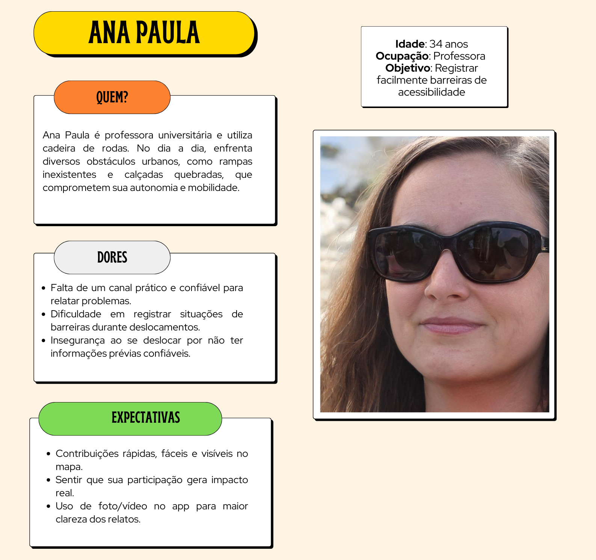
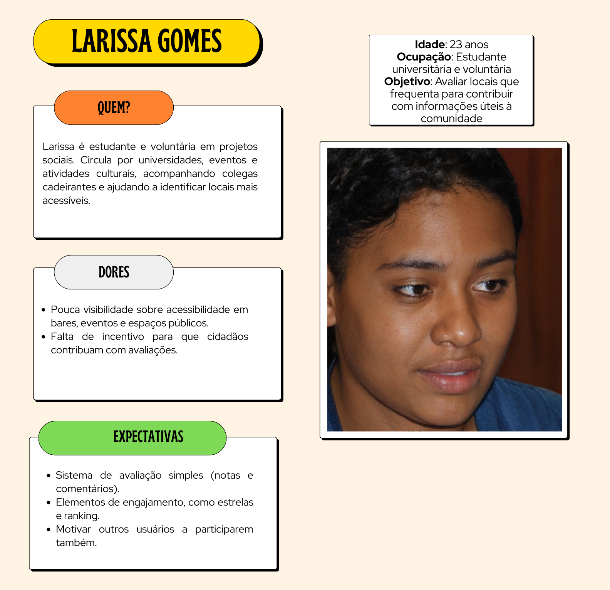
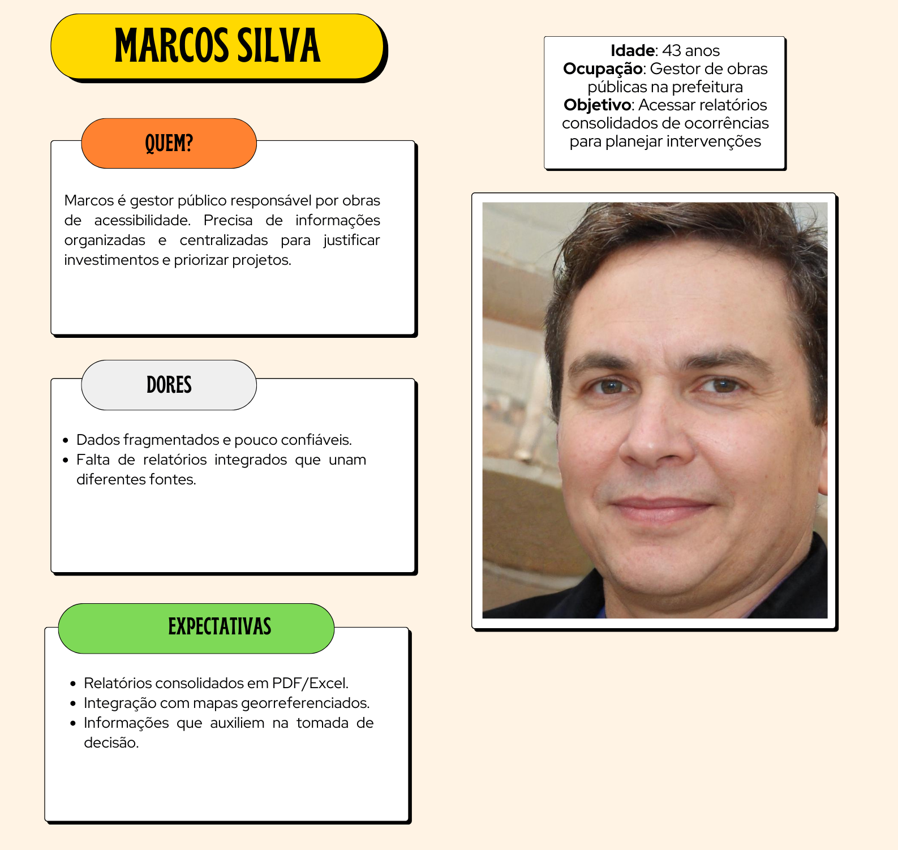
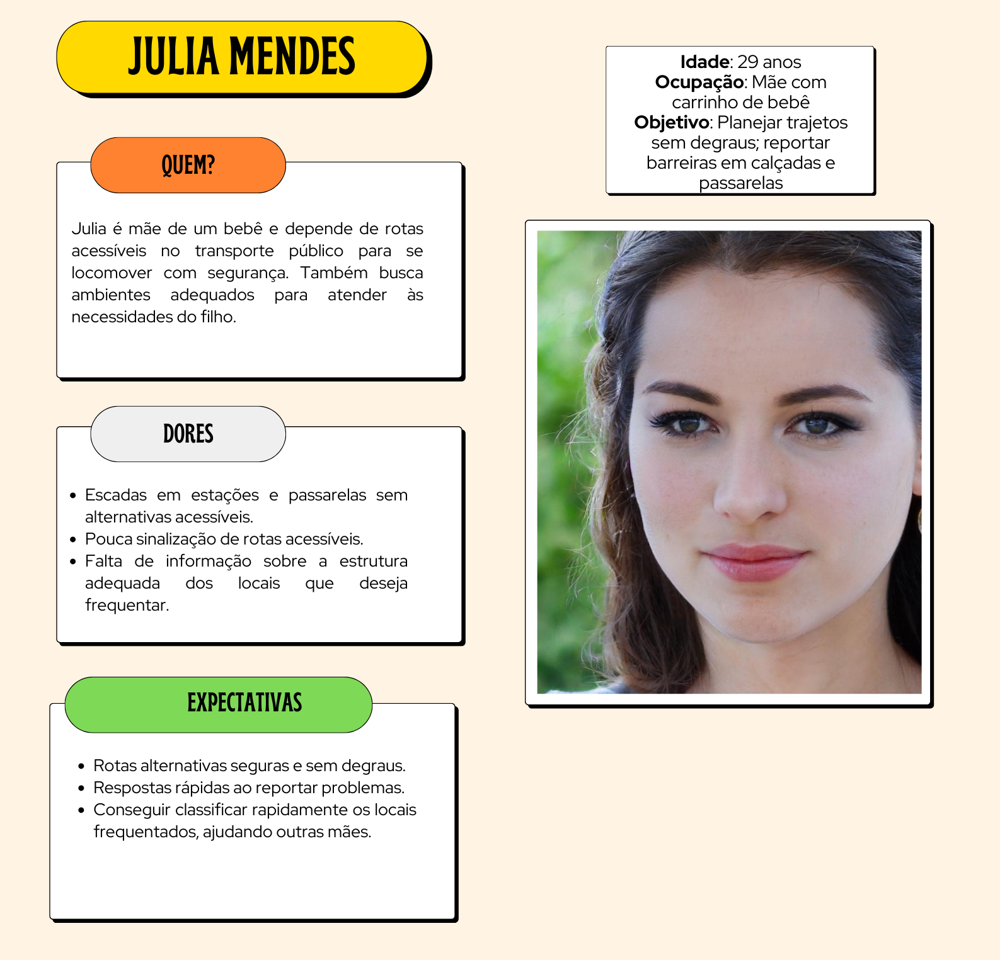
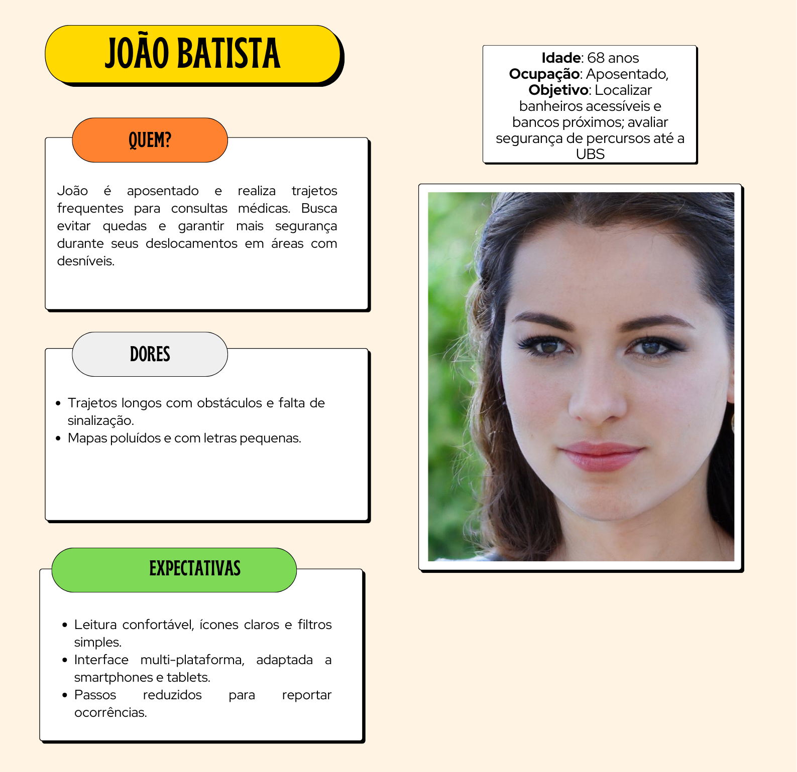
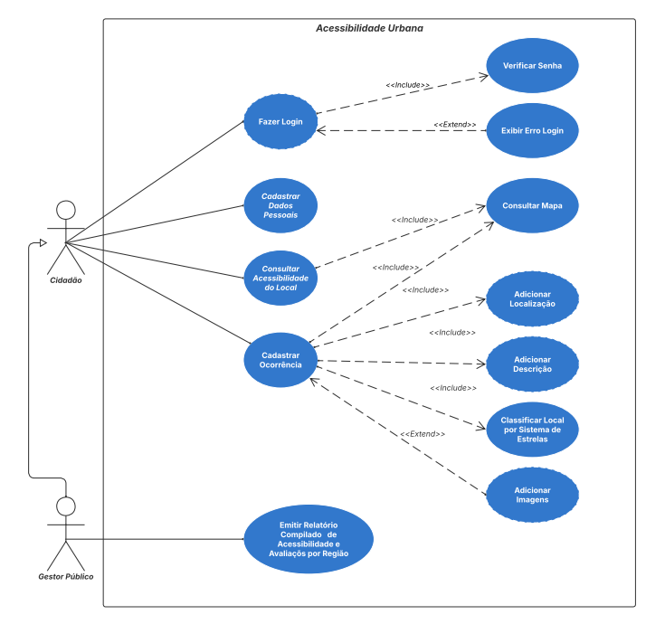

# Especificações do Projeto

Pré-requisitos: <a href="1-Documentação de Contexto.md"> Documentação de Contexto</a>

## Personas

>
## Histórias de Usuários

Com base na análise das personas forma identificadas as seguintes histórias de usuários:

| EU COMO... `PERSONA`            | QUERO/PRECISO ... `FUNCIONALIDADE`                                    | PARA ... `MOTIVO/VALOR`                                                         |
|---------------------------------|---------------------------------------------------------------------- |---------------------------------------------------------------------------------|
| Ana Paula (Mobilidade reduzida) | Registrar facilmente barreiras de acessibilidade                      | Para que outras pessoas possam evitar dificuldades e o poder público possa agir |
| José Souza (Mobilidade reduzida)| Visualizar locais acessíveis próximos a mim                           | Para planejar meus trajetos com segurança e autonomia                           |
| Larissa Gomes (Cidadã)          | Avaliar locais que frequento                                          | Para contribuir com informações úteis à comunidade                              |
| Marcos Silva (Gestor municipal) | Acessar relatórios consolidados de ocorrências                        | Para priorizar obras e justificar investimentos em acessibilidade               |
| Julia Mendes (Mãe de bebê)      | Verificar locais com estrutura adequada para as necessidades do filho | Para planejar deslocamentos com segurança e conforto                            |
| João Batista (Aposentado)       | Visualizar caminhos com menor risco de quedas e maior acessibilidade  | Para me deslocar com segurança e independência                                  |

## Requisitos

As tabelas que se seguem apresentam os requisitos funcionais e não funcionais que detalham o escopo do projeto.

### Requisitos Funcionais

|ID    | Descrição do Requisito                                                                                                                   | Prioridade |
|------|------------------------------------------------------------------------------------------------------------------------------------------|------------|
|RF-001| O sistema deve permitir ao usuário registrar ocorrências de acessibilidade, com foto, GPS, categoria, severidade (1–5) e descrição.      | ALTA       | 
|RF-002| O sistema deve disponibilizar um mapa com pontos de acessibilidade reportados, permitindo consulta por endereço ou geolocalização.       | ALTA       |
|RF-003| O sistema deve permitir que usuários avaliem locais com notas (1 a 5 estrelas) e comentários opcionais.                                  | MÉDIA      |
|RF-004| O sistema deve gerar relatórios consolidados de acessibilidade por região, contendo indicadores e mapa georreferenciado.                 | MÉDIA      |
|RF-005| O sistema deve permitir aplicar filtros simples no mapa por categoria (ex.: rampas, banheiros, calçadas).                                | BAIXA      |
|RF-006| O sistema deve permitir que, ao clicar em um ponto do mapa, o usuário veja os detalhes da ocorrência: categoria, foto e status.          | ALTA       |
|RF-007| O sistema deve permitir o registro e a consulta de locais que possuam estruturas de apoio voltadas a diferentes grupos de usuários.      | MÉDIA      |
|RF-008| O sistema deve permitir que os usuários personalizem a visualização da interface, ajustando o tamanho da fonte para facilitar a leitura. | ALTA       |
|RF-009| A aplicação deverá ter um sistema de cadastro de conta e login.                                                                          | ALTA       |

### Requisitos não Funcionais

| ID     | Descrição                                                                                                                                             | Prioridade |
|--------|-------------------------------------------------------------------------------------------------------------------------------------------------------|------------|
| RNF-01 | A plataforma deve garantir segurança e proteção dos dados dos usuários.                                                                               | ALTA       |
| RNF-02 | A interface deve ser intuitiva e exigir pouco conhecimento tecnológico para realizar o registro.                                                      | ALTA       |
| RNF-03 | O sistema deve seguir as diretrizes WCAG 2.1, oferecendo suporte a leitores de tela, contraste adequado e fontes redimensionáveis.                    | ALTA       |
| RNF-04 | O sistema deve ser responsivo e acessível em dispositivos móveis e desktops.                                                                          | ALTA       |
| RNF-05 | O sistema deve ser compatível com os navegadores mais utilizados (Chrome, Firefox e Edge).                                                            | ALTA       |
| RNF-06 | O código deve ser organizado e documentado para facilitar evolução (ex: categorias adicionais de acessibilidade).                                     | ALTA       |
| RNF-07 | Não devem ser coletados dados pessoais sensíveis, com um aviso na área de fotos anexadas, para que sejam anonimizadas.                                | ALTA       |
| RNF-08 | O sistema deve ser estável e oferecer disponibilidade contínua.                                                                                       | ALTA       |

## Restrições

O projeto está restrito pelos itens apresentados na tabela a seguir.

| ID    | Restrição                                                                                                                                            |
|-------|------------------------------------------------------------------------------------------------------------------------------------------------------|
| RES01 | O aplicativo deve armazenar apenas dados necessários para o funcionamento (evitando coleta excessiva de informações pessoais).                       |
| RES02 | O aplicativo não será totalmente acessível a todos os públicos no lançamento, devido a restrições de tempo e recursos da equipe.                     |
| RES03 | O upload de imagens será limitado em tamanho e quantidade (ex.: até 2 fotos por ocorrência, 5 MB cada).                                              |
| RES04 | O aplicativo não fará reconhecimento facial nas fotos carregadas.                                                                                    |

## Diagrama de Casos de Uso

## Vídeo de apresentação do projeto

https://github.com/user-attachments/assets/2d79c916-ea7e-46d6-b010-6162e34d6315
